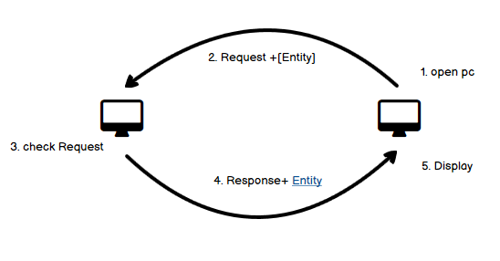
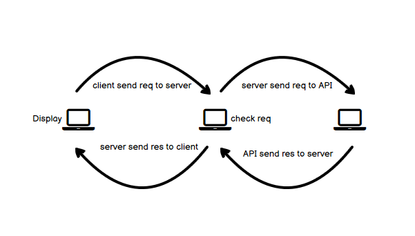

# Movies-Library - 1.0.0

**Author Name** :  Anas Abuobaid

## WRRC With Out API

## WRRC With API

## WRRC With Data Base

## Getting Started
<!-- What are the steps that a user must take in order to build this app on their own machine and get it running? -->
## Building a server using Express:

1. npm init -y
2. create an server.js
3. Install express package to use it npm install express
4. added the server code inside server.js
5. run the server using node server.js

## Project Features
<!-- What are the features included in you app -->
* Add more movies
* Connect With DB
* Add Search Movie
* Add Play list For You
* Add Some Changes In The Style

